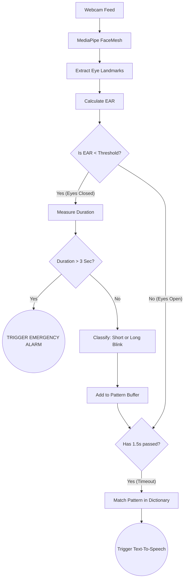

# STUDENT PROJECT PROPOSAL
**Academic Year 2025 / 2026**
**El Sewedy University of Technology**

---

## 1. Project Information
| Project Title | Eye-To-Speak: A Low-Cost, Pattern-Based AAC System for Paralyzed Patients |
| :--- | :--- |
| **Program / Department** | Faculty of Engineering Technology |
| **Date of Submission** | 31 July 2025 |

**Team Members**
*List all team members with full name, ID, specialization, and role on the team.*
| # | Full Name | ID | Specialization | Role on Team |
| :--- | :--- | :--- | :--- | :--- |
| 1 | Ahmed Tarek | [Your ID] | [Your Specialization] | Team Leader |
| 2 | | | | |
| 3 | | | | |
| 4 | | | | |

**Supervisor**
| Name | Dr. [Supervisor Name] |
| :--- | :--- |
| **Email** | [Supervisor Email] |
| **Department** | [Supervisor Department] |

**Industry Partner / Stakeholder (if any)**
*If your project is in collaboration with a company, NGO, or government entity, list them here. Leave blank if not applicable.*
| Organization | |
| :--- | :--- |
| **Contact Person** | |
| **Nature of Collaboration** | |

---

## 2. Project Overview

### Abstract / Summary
Eye-To-Speak is an advanced, computer-vision-based Augmentative and Alternative Communication (AAC) system designed specifically for paralyzed individuals and those suffering from locked-in syndrome (e.g., ALS). Current low-cost AAC systems force users to spell out words using exhausting, high-cognitive-load methods like Morse code, which severely limits their communication speed and causes rapid eye fatigue. Eye-To-Speak revolutionizes this approach by utilizing a "Pattern-to-Phrase" blink dictionary based on motor automaticity and semantic compaction. By utilizing a standard webcam and lightweight facial landmark tracking (MediaPipe FaceMesh), the system detects micro-blinks and prolonged eye closures, mapping them to essential conversational and physical needs phrases (e.g., "I need help," "Yes/No"). Furthermore, the system integrates a "Dead-Man's Switch"—an automated 3-second continuous eye closure detector that triggers an immediate medical emergency alarm, ensuring patient safety. The software outputs directly to local Text-To-Speech engines without requiring expensive proprietary hardware.

### Keywords
Augmentative Communication (AAC), Computer Vision, Eye Tracking, MediaPipe, Assistive Technology, Medical Software

---

## 3. Problem Statement, Market Need & Industry Relevance

### 3.1 Problem Definition
Paralyzed patients, intubated ICU patients, and individuals with advanced ALS possess intact cognitive functions but lack the motor ability to speak or sign. Their only reliable motor function is often eye movement or blinking. Existing solutions are deeply flawed: commercial eye-tracking systems (like Tobii Dynavox) cost thousands of dollars, making them inaccessible to average families. Conversely, free alternatives rely on spelling via Morse-code blinking or Dwell-Time typing. 
*   **Dwell-Time Typing** forces users to stare at letters for ~800ms, which causes the "Midas Touch" problem (accidentally clicking items they are merely reading).
*   **Continuous Gaze (Dasher)** has a massive learning curve, feeling like steering a vehicle with the eyes.
*   **Morse Code Blinking** requires up to 15 deliberate, timed blinks just to spell a 5-letter word, resulting in severe physical exhaustion and speeds under 2 WPM. 
There is a critical gap for a low-cost, software-only AAC system that eliminates the Midas Touch and prioritizes low cognitive load.

### 3.2 Industrial or Societal Relevance
In Egypt and across developing nations, public healthcare facilities and middle-to-low-income families cannot afford the 2,000+ USD price tag of proprietary AAC tablets. As a result, paralyzed patients are often reduced to communicating via printed alphabet boards pointed at by a nurse—a slow and undignified process. By providing a purely software-based solution that runs on any standard laptop or hospital monitor with a 15 USD webcam, Eye-To-Speak democratizes assistive technology. It restores autonomy and dignity to the physically disabled, drastically improving their psychological well-being and reducing the burden on 24/7 care staff.

### 3.3 Market Need / Value Proposition
**Target Market:** Public hospitals, ICU wards, rehabilitation centers, and families of patients with ALS, cerebral palsy, or severe spinal cord injuries. 
**Value Proposition:** A highly accessible, zero-hardware-dependency communication suite that costs virtually nothing to deploy, runs locally (privacy-preserving), and requires significantly less physical effort to operate than competing blink-based spellers.

---

## 4. Objectives & Success Criteria

| # | Objective | Success Criterion (measurable) |
| :--- | :--- | :--- |
| 1 | **Blink Detection Accuracy** | System correctly registers >95% of intentional blinks (Short and Long) without false positives in standard room lighting. |
| 2 | **Pattern Recognition Timing** | The 1.5-second timeout window successfully differentiates and triggers multi-blink patterns (e.g., Long-Short) with >90% reliability. |
| 3 | **Emergency Response Latency** | The system detects a continuous 3-second eye closure and triggers the panic alarm within 3.5 seconds of the initial closure. |
| 4 | **Low-Cost Deployment** | The system runs at ≥ 30 FPS on a standard consumer laptop without requiring external GPU processing or proprietary eye-tracking hardware. |

---

## 5. Innovation & Expected Impact

### 5.1 What Makes This Project Innovative
While eye-tracking is not new, applying **Semantic Compaction and Motor Automaticity** to blink-based AAC is highly novel. Instead of spelling words character-by-character (which causes rapid eye fatigue), Eye-To-Speak categorizes phrases by their "starting blink" (e.g., Short for social, Long for physical needs) and strictly limits patterns to a maximum of 3 blinks. This reduces cognitive load from a conscious math problem into subconscious muscle memory. Furthermore, integrating a "Dead-Man's Switch" (a 3-second continuous closure) natively into the computer vision loop transforms the software from a passive communication tool into an active, life-saving medical monitor without requiring expensive proprietary hardware.

### 5.2 Expected Impact
*   [x] Community benefit / social impact
*   [x] Cost saving / efficiency improvement
**Primary Expected Impact:** Radically improves the quality of life and safety of paralyzed patients while completely eliminating the financial barrier to entry for advanced assistive communication tech.

---

## 6. Methodology & Technical Approach

### 6.1 Approach Overview
The system is built entirely in Python, utilizing OpenCV for video feed management and MediaPipe FaceMesh for lightweight, real-time facial landmark detection. 
1. **Extraction:** The system extracts the 12 key landmarks corresponding to the left and right eyes.
2. **EAR Calculation:** It calculates the Eye Aspect Ratio (EAR) for each frame. A dynamic calibration sequence at startup sets a baseline threshold unique to the user's facial structure and camera angle.
3. **Temporal Analysis:** A `BlinkGesture` module tracks the duration of EAR dips to classify events as `Short Blinks`, `Long Blinks`, or `Emergency Closures` (> 3 seconds).
4. **Pattern Buffering:** Blinks are fed into a `PatternBuffer`. If the user pauses for 1.5 seconds, or if the buffer hits the 3-blink limit, the pattern is locked in.
5. **Execution:** The pattern is matched against the localized dictionary and sent directly to the operating system's Text-to-Speech (TTS) engine.

### 6.2 Tools, Hardware & Software
*   **Hardware platforms:** Any standard PC/Laptop (Windows/macOS/Linux) and a standard USB Webcam.
*   **Software & languages:** Python, OpenCV (cv2), MediaPipe (FaceMesh).
*   **Datasets / standards:** Pre-trained Google MediaPipe FaceMesh Dataset (30,000+ images for 3D facial landmarks).
*   **Methods / algorithms:** Eye Aspect Ratio (EAR) Euclidean distance calculation, Temporal state-machine buffering, Text-To-Speech (TTS).

### 6.3 Block Diagram / Process Flow

---

## 7. Project Deliverables

| | Deliverable | Description |
| :--- | :--- | :--- |
| [x] | **Working prototype / hardware system** | Python application capable of real-time AAC. |
| [x] | **Software / source code** | Full GitHub repository with `cv-module` and documentation. |
| [x] | **Technical report & documentation** | The final thesis and `bug_analysis` research logs. |
| [x] | **Final presentation** | Slide deck for the defense committee. |
| [x] | **Demonstration video** | A live recording of a user utilizing the dictionary and triggering the emergency alarm. |
| [ ] | **Dataset / analysis output** | |
| [ ] | **Other (specify)** | |

---

## 8. Timeline & Milestones

| Phase / Milestone | Start Date | End Date | Deliverable | Responsible Member |
| :--- | :--- | :--- | :--- | :--- |
| Literature Review & Requirements | 01 Aug 2025 | 15 Aug 2025 | Requirement Specifications | Ahmed Tarek |
| Design & Methodology | 16 Aug 2025 | 01 Sep 2025 | System Architecture Design | Ahmed Tarek |
| Prototype Development | 02 Sep 2025 | 15 Oct 2025 | Working cv-module code | Ahmed Tarek |
| Testing & Validation | 16 Oct 2025 | 01 Nov 2025 | Bug Analysis & Patches | Ahmed Tarek |
| Final Report & Defense | 02 Nov 2025 | 15 Nov 2025 | Thesis & Presentation | Ahmed Tarek |

---

## 9. Resources & Estimated Budget

### 9.1 Required Resources
*   Standard laptop computers for development.
*   Standard USB Webcams for testing different angles and lighting conditions.
*   Access to Python development environments (VSCode, Git).

### 9.2 Estimated Budget (Bill of Materials)
| Item / Component | Quantity | Unit Cost (EGP) | Total (EGP) |
| :--- | :--- | :--- | :--- |
| Standard USB Webcam (if required) | 1 | 500 EGP | 500 EGP |
| **TOTAL ESTIMATED BUDGET** | | | **500 EGP** |

**Funding Source (if any):** Self-funded
*(Note: Because this is a software-centric solution designed to eliminate hardware costs, the budget is exceptionally low).*

---

## 10. Risk Assessment & Safety Considerations

| # | Risk | Likelihood | Impact | Mitigation |
| :--- | :--- | :--- | :--- | :--- |
| 1 | **Poor Lighting affecting FaceMesh** | Medium | High | Utilize dynamic calibration (100 frames) on startup to adjust the baseline EAR threshold based on current lighting. |
| 2 | **False Positive Emergency Alarm** | Low | Medium | Require a strict 3.0-second continuous closure, ensuring standard long-blinks or tracking glitches do not trigger the alarm. |
| 3 | **Zero Division Crash in EAR** | Low | High | Implemented `max(C, 1e-6)` safety buffer in the Euclidean distance calculation to prevent mathematical crashes. |

### Safety Precautions
Because this software acts as a medical communication tool, the primary safety concern is **Software Reliability**. The `Dead-Man's Switch` (Emergency Alarm) bypasses the pattern buffer entirely to ensure immediate execution. Code has been hardened against mathematical crashes to ensure 24/7 uptime.

---

## 11. References
**Your References:**
4. T. Soukupova and J. Cech, "Real-Time Eye Blink Detection using Facial Landmarks," in *21st Computer Vision Winter Workshop (CVWW2016)*, Rimske Toplice, Slovenia, 2016, pp. 1–8.
5. "MediaPipe Face Mesh," Google for Developers. [Online]. Available: https://developers.google.com/mediapipe/solutions/vision/face_landmarker. [Accessed: 23 Jul 2025].
6. G. Bradski, "The OpenCV Library," *Dr. Dobb's Journal of Software Tools*, vol. 25, no. 11, pp. 120–123, 2000.
7. B. Baker, "Semantic Compaction for Augmentative Communication," *Augmentative and Alternative Communication*, vol. 3, no. 4, pp. 195–201, 1987.
8. D. R. Beukelman and P. Mirenda, *Augmentative and Alternative Communication: Supporting Children and Adults with Complex Communication Needs*, 4th ed., Baltimore, MD, USA: Paul H. Brookes Publishing Co., 2013.

---

## 12. Supervisor Background, Related Projects & Expertise

### 12.1 Brief Background & Expertise
*(To be filled by the supervisor: brief background, area of expertise, and any related projects supervised in recent years.)*

### 12.2 Related Projects Previously Supervised
*   *(To be filled by supervisor)*
*   *(To be filled by supervisor)*

---

## 13. Approval & Signatures

| Role | Name | Signature & Date |
| :--- | :--- | :--- |
| **Supervisor** | Dr. [Supervisor Name] | |
